# Double Seven Guitars - Milestone Project 1

This website is created for the business Double Seven Guitars which is primarily offering guitar repair and maintenance work at an affordable price. The main purpose of the website is to allow customers to find the business and make contact for repairs.


## Table of contents

1. [UX Design](#ux-design-1)
   - 
   - [Strategy - Consumer Goals](#strategy---consumer-goals)
   - [Strategy - Business Goals](#strategy---business-goals) 
   - [Strategy - User Stories](#strategy---user-stories) 
   - [Strategy - Importance vs Viability](#strategy---importance-vs-viability)
   - [Scope](#scope)
   - [Structure](#structure)
   - [Skeleton - Wireframes](#skeleton---wireframes)
   - [Surface - Design Choices](#surface---design-choices)

2. [Features](#features-1)
   - 

3. [Tools and Technologies Used](#tools-and-technologies-used-1)
   -

4. [Testing](#testing-and-validation)
   -

5. [Deployment and Local Development](#deployment-1)
   -
6. [Credits](#credits)
   -
   * [Images](#images)
   * [Code](#code)
   * [Content](#content)

7. [Acknowledgements](#acknowledgements)
   -
## UX Design

### Strategy - Consumer Goals 
The main goal of the consumer is to find a business that can repair their broken guitar or offer routine maintenance. 

Consumers want a method to understand: 

- If the repair or maintenance they require is offered by the business 
- How to make contact and request a repair
- The location of the repairs 
- If the business has prior experience with said repairs (quality – does it look credible and trustworthy?)
- If the business has been positively reviewed (quality – does it look credible and trustworthy?)
- The cost of any potential repairs 

### Strategy - Business Goals 

- To increase the number of customers deciding to contact for repair 
- To encourage first-time visitors to make a request for services

### Strategy - User Stories

#### First time visitor (novice or experienced)
- As a first time visitor, I want to see the prices clearly, so that I can decide if the repair is in my price range. (A) 
- As a first time visitor, I want to understand how to get in contact, so that I can request a repair on my guitar. (B) 
- As an first time visitor, I want to see the reviews of the business, so that I can see how well-known and liked they are and thus have confidence in the guitar repair (particularly important for experienced guitar owner). (C) 
- As a first time visitor, I want to check the location of the business, so that I can see if it is feasable to drop off/pick up my guitar. 

#### Novice guitar owner (first time visit)
- As a novice guitar owner (first time visit), I want to see a clear and easy-to-understand list of services, so that I can choose the appropriate service. (E) 
- As a novice guitar owner (first time visit), I want to be given information of about types of repairs and maintenance so that I can understand what services I might need. (F)


#### Experienced guitar owner (first time visit)

- As an experienced guitar owner (first time visit), I want to see whether more complicated repairs are available, so that I can decide if my problem can be resolved by the business. (G)
- As an experienced guitar owner (first time visit), I want to see what types of repairs the business has experience in, so that I can trust my more complicated guitar repair with the business. (H)


#### Returning Visitor (second+ repair)
- As a returning visitor, I want to check the contact details again to ensure I have them correct for a request of another repair. (I)

### Strategy - Importance vs Viability 

| Opportunity/Problem | Importance | Viability
| ----------- | ----------- | ----------- 
| To provide information about the core purpose of the business | 5 | 5 |
| To provide cost information | 5 | 5
| To showcase owner's guitar playing ability | 2 | 5 |
| To increase following to owner's band | 2 | 5
| To showcase the types of repairs completed by the business | 4 | 5
| To highlight good reviews of the business | 5 | 5
| To provide contact details of the business | 5 | 5
| To provide information about the owner's work history as a racecar mechanic | 3 | 5
| Totals | 31 | 40

As these totals are quite different, this has highlighted that not all of these should be implemented. 

| Opportunity/Problem | Importance | Viability
| ----------- | ----------- | ----------- 
| To provide information about the core purpose of the business | 5 | 5 |
| To provide cost information | 5 | 5
| To showcase the types of repairs completed by the business | 4 | 5
| To highlight good reviews of the business | 5 | 5
| To provide contact details of the business | 5 | 5
| Totals | 24 | 25

By removing three of the opportunities the totals come closer and it has created a more manageable set of goals.

### Scope

To be included in the website: 

- consistent navigation menu and footer so information can be found easily
- a primary information section to explain what the business does 
- an explanation and list of services provided
- some media showing what repairs have been done 
- examples of good reviews
- easily accessible contact information, maybe repeated, to increase the chance of "first-time-purchase" which in this case is a repair request
- a variety of ways to make contact so customers can choose their preferred method
- location information so customers know where to drop off and pick up guitars 

### Structure

All pages will contain navigation links to all pages and a footer with contact information.

The website will contain three pages (plus a 404.html):

- Home Page: this will contain the primary information, some information about services offered and some reviews.

- Services Page: this will contain a list of services and corresponding prices and some videos and images of repairs completed by the business.

- Contact Page: This will include phone number, email adress, facebook link, contact form and location information such as address and map. 

### Skeleton - wireframes

The wireframes below have been adapted slightly, with buttons being added at various places linking back to contact details and the list of services as well as a dropdown menu on the contact navigation link to make it easier to choose the type of contact or choose the location information.

#### Home Page

  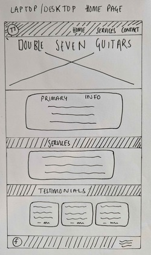

#### Services Page

  

#### Contact Page

 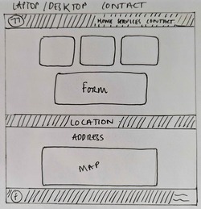


### Surface - Design Choices 

#### Colour Scheme

The main business logo has been discarded (with owners permission): 


But the 77 element has been retained as the logo for the website:

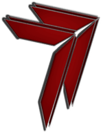

This colour palette is inspired by the business logo which features red, black and grey. 


#### Typography 

I have used google fonts and chosen "Dosis":


For the typography used for the brand name I used www.picturetopeople.org to generate a more unique looking font as an image with a clear background: 


#### Imagery

Images provided by the business and sourced from unsplash.

## Features

### Footer

This is common to all pages, contains contact details and the facebook icon links to the business facebook page: 

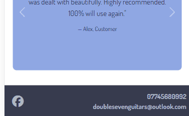

### Navigation Bar
This is common to all pages. Navigation bar that uses the business logo as a link for the home page. The navigation link are on the right side and the active page is a different colour and made larger: 

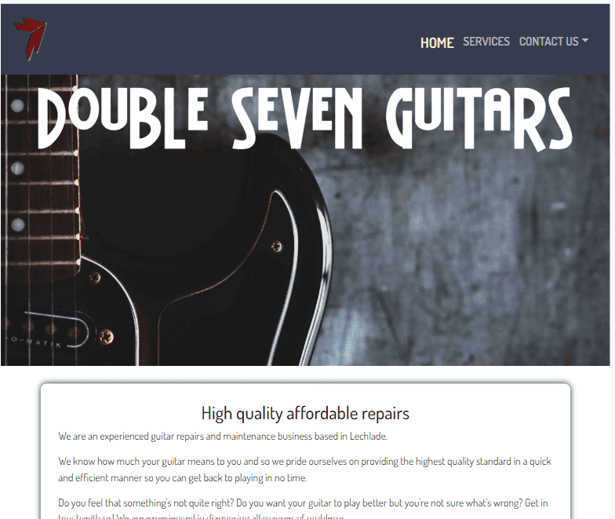
On a mobile device the navigation links collapse: 

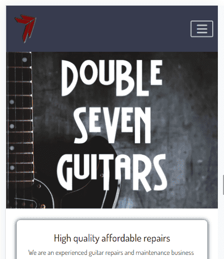

The contact navigation link has a further dropdown so preferred communication can be chose and so location is easily found: 

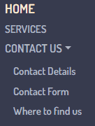


### Home Page


#### Hero image and title 

The hero image is overlapped by the title image: 

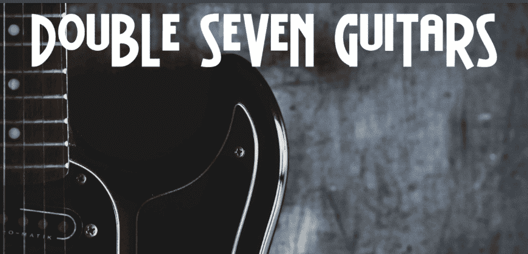

On a mobile the title is presented vertically and a different image was used with a different ratio to make everything look more proportional: 


#### Primary information section

This section sits underneath the hero and is designed to tell the user about the business straight away. It has a button that takes you to the contact page to increase the chance of a first-time-visit purchase:

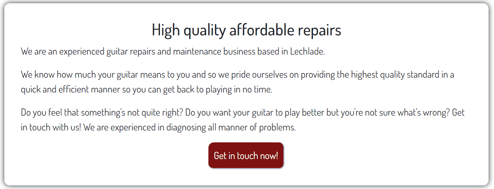

It is responsive a shrinks with the screen size and margin is maintained: 

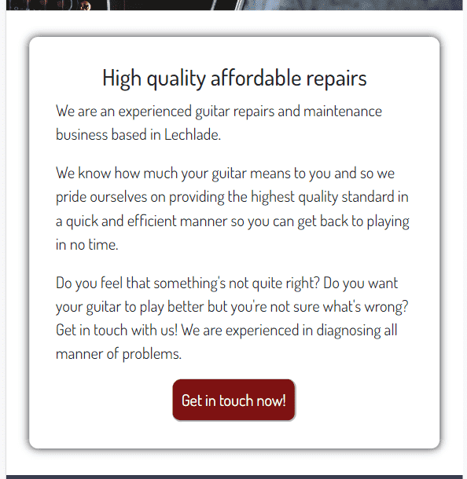

#### Services Section 

This sections includes a dark grey banner that appear, consistnetly, on all pages. Services are bulleted with icons and button that leads directly to the table of services on the services page:

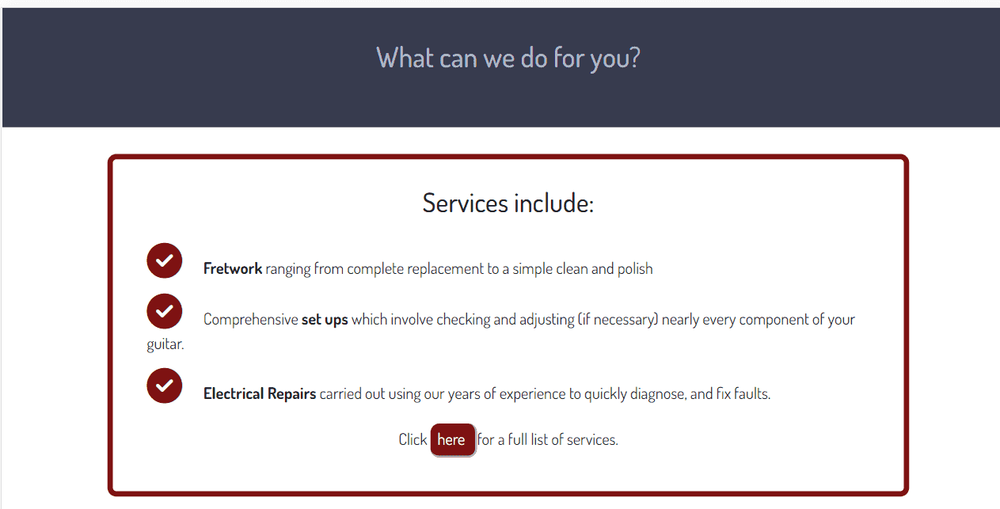

It is responsive on smaller screens: 

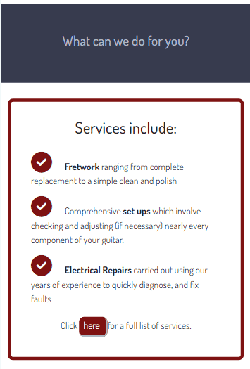

#### Testimonials Section 

This section includes the common banner and features three good reviews:

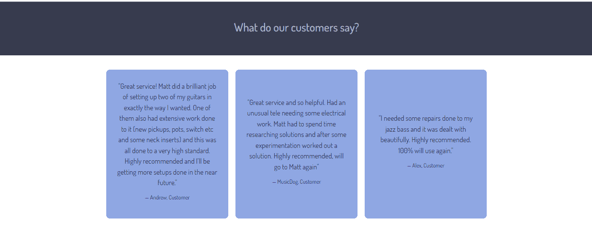

Responsive on a medium screen: 

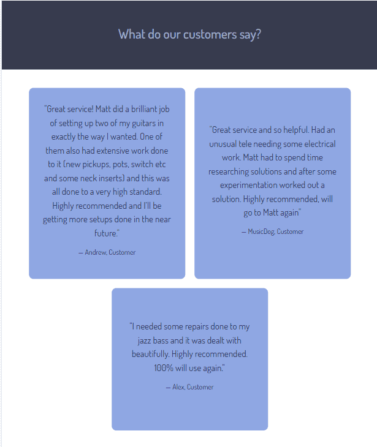

Responsive on a mobile - on these smaller screens the testimonals appear as a carousel for people to click through: 

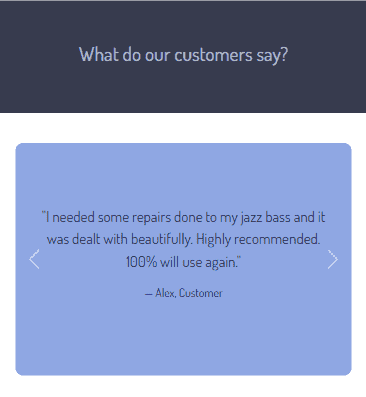


### Services Page


#### Services hero image

The services hero image appears under the navigation bar and above the services table section: 

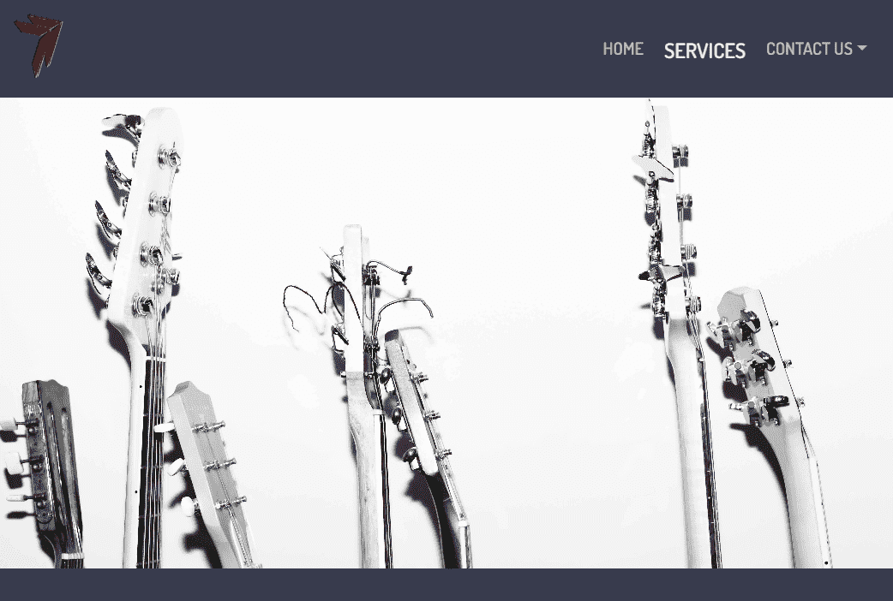

On a mobile the proportions of the hero image are slightly different:

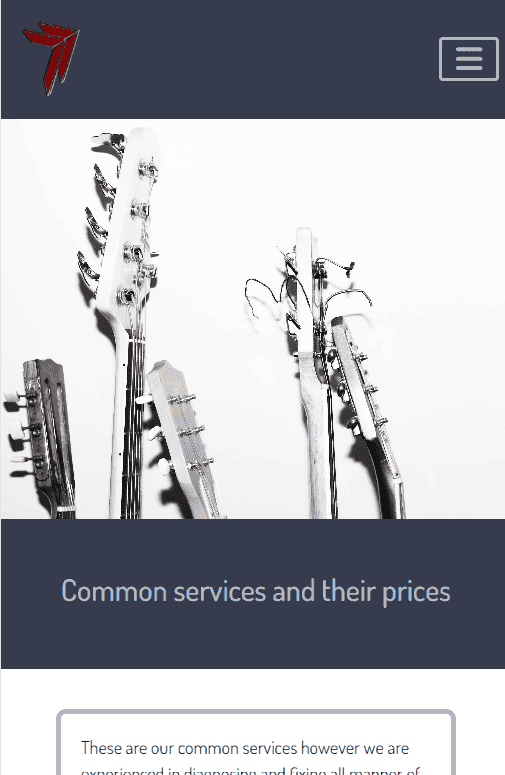

#### Table of services 
The table of services sits under the commonly styled banner (see home page). Hovering over the table rows makes the background the double seven red colour and the text white. There is a button that takes you to the contact page if you would like to request a service. 

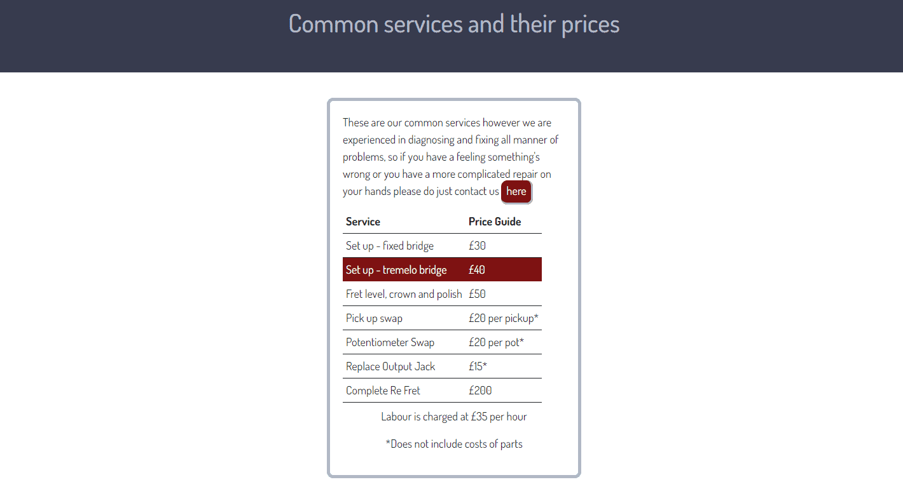

#### Video and gallery section

Underneath another banner there is a video to showcase an example repair: 

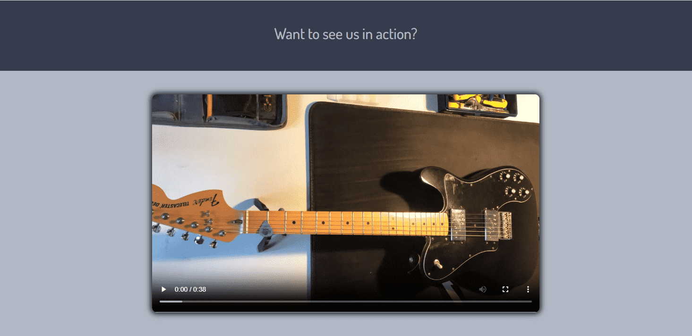

Underneath the video sits the gallery section. On a hover or click the cards in the gallery section get an opaque black overlay and get slowly larger and slowly smaller when hover is removed or a click happens elsewhere: 

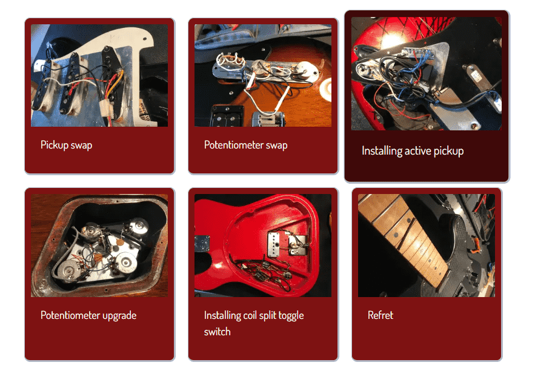

The gallery is responsive and on a medium screen looks like: 

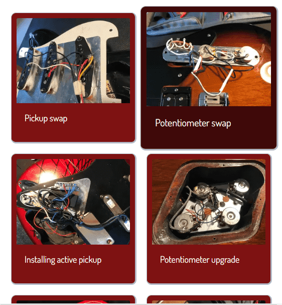

On a mobile device the cards stack on top of each other and look like this: 

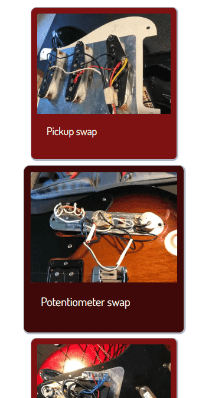

### Contact Page

#### Contact Boxes

At the top of the contact page there are three boxes showing forms of contact. The red facebook button has a border to the right and to the bottom to add "affordance" and make it look more clickable than the others. In future implementations, I would want the phone and email to be clickable instantly copy to the person's device. 

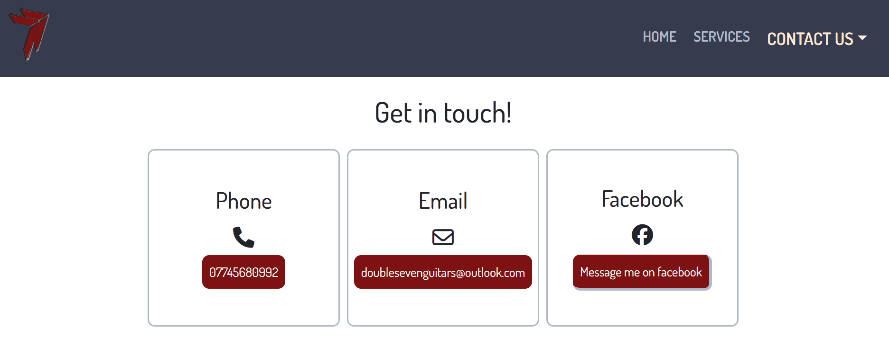

On a medium screen:


And stacked on top of each other on a mobile: 

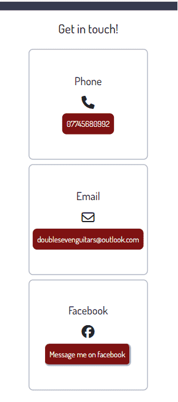

#### Address and map

The top of this section has the common banner.
This sections features the address in a box in the same style as the contact boxes and an embedded google map underneath.


The map is responsive and shrinks to fit mobile: 

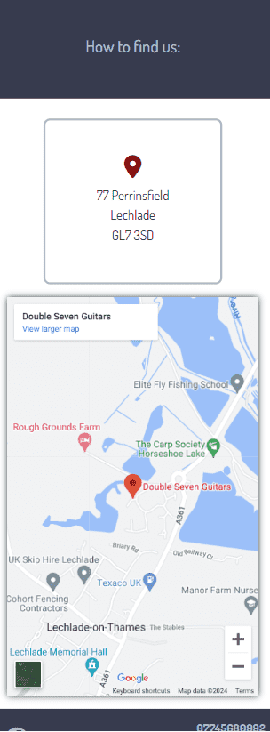

### 404.html Page

The 404 page has a whimsical/jokey message and a button to return to the main home page:


The page is responsive on a mobile: 

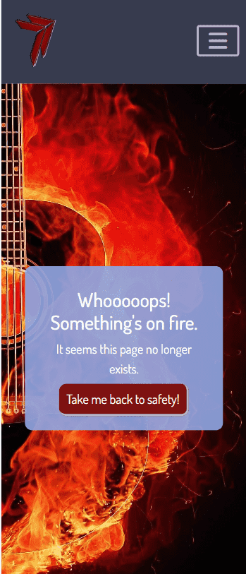


## Tools and Technologies Used
 - Custom HTML and CSS were used throughout.
 - [Boostrap v5.3](https://getbootstrap.com/docs/5.3/getting-started/introduction/) was used in this project at various points for layout, form styling, creating cards and the navbar. I made some adaptations to the bootstrap styling at various points too. 
 - CSS Flexbox was also used for layout purposes (outside of bootstrap) - the reason I used flexbox without bootstrap was that it felt lighter and more customisable in places in addition to giving me good practice of using both flexbox and bootstrap for layout. 
 - Git for version control
 - Github for saving and storing files
 - VS Code for locally coding my project (to replace the use of online IDE such as gitpod or codeanywhere)
 - [Google Fonts](https://fonts.google.com/) for the font used in the website
 - Google developer tools to to test the wesbite for responsiveness and to fix bugs.
 - [Picture to people](https://www.picturetopeople.org/text_generator/others/transparent/transparent-text-generator.html "Picture to People website") was used to generate the title with transparent background that overlays the hero image. 
 - [Image Resizer](https://imageresizer.com "Image Resizer Website") was used to compress and resize images. 
 - [Convertio](https://convertio.co/) for turning jpg to webp
 - [Coolors](https://coolors.co/ "Coolors Website") was used to generate the colour pallete. 
 - Google Maps API to embed a map using an iframe.
 - [Font Awesome](https://fontawesome.com/) was used for all icons used in my page.
 - [Am I Responsive?](https://www.google.com/search?q=am+i+responsive&rlz=1C1ONGR_en-GBGB985GB985&oq=am+i+respon&gs_lcrp=EgZjaHJvbWUqBggAEEUYOzIGCAAQRRg7MgYIARBFGDkyBggCEEUYQDIGCAMQRRhBMgYIBBBFGDwyBggFEEUYPNIBCDE4NTRqMGo3qAIAsAIA&sourceid=chrome&ie=UTF-8) to show how the website looks on different size screens and devices.
 - WAVE chrome extension for accessibility testing
 - WCAG Contrast checker chrome extension for colour constrast checking
- [W3C Validator](https://validator.w3.org/) for validating html and css


## Testing and Validation

Testing and validation have been included in a separate [file](testing.md).

## Deployment and local development

### Deployment

Github Pages was used to deploy the live website. The instructions to achieve this are below:

1. Log in to Github
1. Find the repository for this project (double-seven-guitars)
3. Click on the Settings button at the top of the screen.
4. Click on the Pages button on the left navigation bar.
5. Go to the Build and Deployment section. 
6. Make sure the Source is "deploy from a branch"
7. Go to the Branch section, choose main and /root.
8. Click Save. Your live Github Pages site is now deployed at the URL shown.

### Local Development

#### How to Fork:
To fork the double-seven-guitars repository:

1. Log in to Github
2. Go to the repository for this project (double-seven-guitars)
3. Click the Fork button on the top right

#### How to Clone

##### In VS Code: 
1. Open VS Code
2. Select "Clone Git repository"
3. Type in https://github.com/AmyB173/double-seven-guitars.git 
4. Choose a local destination for the folder
5. Click open

##### In Gitpod 
1. Sign in to Gitpod
2. Select new workspace 
3. Type in https://github.com/AmyB173/double-seven-guitars.git 

## Credits

### Images

Any images that are not listed below have been sourced from the business owner and used with their permission.

- Hero Image on main page (with guitar brand name removed):  Photo by [Annie Spratt](https://unsplash.com/@anniespratt) on [Unsplash](https://unsplash.com/photos/a-black-electric-guitar-with-a-black-background-LtD7qn9k108)

- Hero image on services page: Photo by [Diego Catto](https://unsplash.com/@diegocatto) on [Unsplash](https://unsplash.com/photos/grayscale-photography-of-guitar-heads-DI6ywiG5N0g)

- Background image on 404.html: Photo by [Dark Rider](https://unsplash.com/photos/flaming-guitar-digital-wallpaper-JmVaNyemtN8) on [Unsplash](https://unsplash.com/photos/flaming-guitar-digital-wallpaper-JmVaNyemtN8)

### Code 
#### General
- W3Schools for general help in understanding html and css
- Code Institute learning material used to develop general html and css knowledge
- Bootstrap documentation for [Bootstrap v5.3](https://getbootstrap.com/docs/5.3/getting-started/introduction/) for help in understanding the bootstrap classes and how to apply them. 
- [CSS tricks](https://css-tricks.com/snippets/css/a-guide-to-flexbox/) website for general help in understanding css flexbox
- For help with the readme, Kera Cudmore's [repository](https://github.com/kera-cudmore/readme-examples/blob/main/README.md#whats-a-readme) was used.

#### Specific Code 
- To overcome the issue with rounded corners taking ellipse shape (see bugs and code issue): [Stack Overflow](https://stackoverflow.com/questions/31617136/avoid-elliptical-shape-in-css-border-radius#:~:text=If%20the%20value%20exceeds%20half,pill%20shape%20on%20rectangular%20elements.&text=border%2Dradius%3A%2050%25%20will,your%20div%20is%20not%20square.)

- To overcome the issue with the fieldset not overlapping the border in bootstrap: https://github.com/twbs/bootstrap/issues/32548. Code used:


My code:
```
<fieldset class="border rounded-3 p-3">
```
- Used this [code](https://codepen.io/xjorye/pen/QgqeEx) to put checkboxes in front and not after labels. 

-  I used the code from [this](https://stackoverflow.com/questions/9724035/how-can-one-create-an-overlay-in-css) stack overflow forum to create the opaque overlay on gallery cards. Code from forum:


My code: 
```
box-shadow: inset 0px 0px 0 1000px rgba(0,0,0,0.5);
```

- I used [this](https://stackoverflow.com/questions/54948759/css-animation-on-hover-snaps-back-to-default-size-after-hovering-away) Stack Overflow Forum To avoid snap back after transformation (see bugs and fixes). Code from forum: 


My code: 
``` 
   .card {
    width: 250px;
    margin: 10px;
    -webkit-transition: transform 0.8s ease-out;    
    -moz-transition: transform 0.8s ease-out;    
    -ms-transition: transform 0.8s ease-out;    
    -o-transition: transform 0.8s ease-out;    
    transition: transform 0.8s ease-out;    
    }    
```
### Content

The content was written by myself and by the owner of Double Seven Guitars.

## Acknowledgements

* Matt Bennett - the owner of Double Seven Guitars, for kindly letting my use his business for my project and for assisting with images and content. 
* Slack Oct 2023 Cohort - for helping with issues I posted on slack.
* Alan Bushell - Oct 2023 Cohort Facilitator, for the helpful advice and guidance offered in the weekly stand-ups. 
* Okwudiri Okoro - Code Institute Mentor, for the feedback on my project.