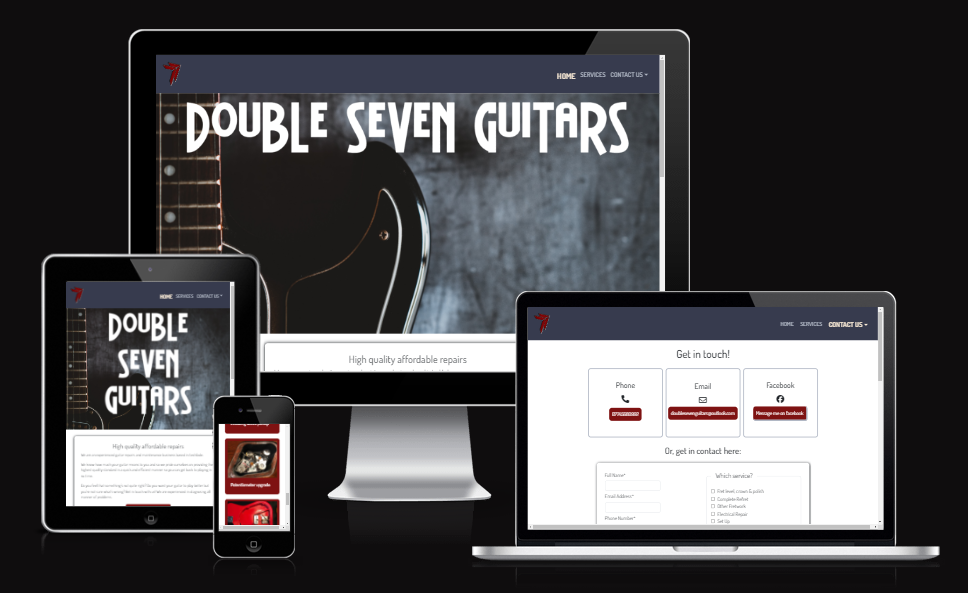
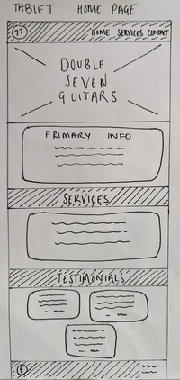
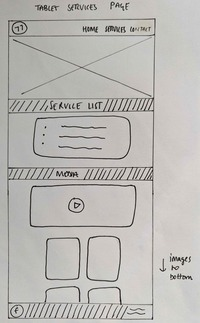

# Double Seven Guitars - Milestone Project 1

This website is created for the business Double Seven Guitars which is primarily offering guitar repair and maintenance work at an affordable price. The main purpose of the website is to allow customers to find the business and make contact for repairs.



## Table of contents

1. [UX Design](#ux-design-1)
   - 
   - [Strategy - Consumer Goals](#strategy---consumer-goals)
   - [Strategy - Business Goals](#strategy---business-goals) 
   - [Strategy - User Stories](#strategy---user-stories) 
   - [Strategy - Importance vs Viability](#strategy---importance-vs-viability)
   - [Scope](#scope)
   - [Structure](#structure)
   - [Skeleton - Wireframes](#skeleton---wireframes)
   - [Surface - Design Choices](#surface---design-choices)

2. [Features](#features)
   - 

3. [Tools and Technologies Used](#tools-and-technologies-used-1)
   -

4. Testing
   -

5. [Bugs, Problems and Fixes](#bugs-problems-and-fixes-1)
   -
6. [Credits](#credits)
   -


## UX Design

### Strategy - Consumer Goals 
The main goal of the consumer is to find a business that can repair their broken guitar or offer routine maintenance. 

Consumers want a method to understand: 

- If the repair or maintenance they require is offered by the business 
- How to make contact and request a repair
- The location of the repairs 
- If the business has prior experience with said repairs (quality – does it look credible and trustworthy?)
- If the business has been positively reviewed (quality – does it look credible and trustworthy?)
- The cost of any potential repairs 

### Strategy - Business Goals 

- To increase the number of customers deciding to contact for repair 
- To encourage first-time visitors to make a request for services

### Strategy - User Stories

#### First time visitor (novice or experienced)
- As a first time visitor, I want to see the prices clearly, so that I can decide if the repair is in my price range. (A) 
- As a first time visitor, I want to understand how to get in contact, so that I can request a repair on my guitar. (B) 
- As an first time visitor, I want to see the reviews of the business, so that I can see how well-known and liked they are and thus have confidence in the guitar repair (particularly important for experienced guitar owner). (C) 
- As a first time visitor, I want to check the location of the business, so that I can see if it is feasable to drop off/pick up my guitar. 

#### Novice guitar owner (first time visit)
- As a novice guitar owner (first time visit), I want to see a clear and easy-to-understand list of services, so that I can choose the appropriate service. (E) 
- As a novice guitar owner (first time visit), I want to be given information of about types of repairs and maintenance so that I can understand what services I might need. (F)


#### Experienced guitar owner (first time visit)

- As an experienced guitar owner (first time visit), I want to see whether more complicated repairs are available, so that I can decide if my problem can be resolved by the business. (G)
- As an experienced guitar owner (first time visit), I want to see what types of repairs the business has experience in, so that I can trust my more complicated guitar repair with the business. (H)


#### Returning Visitor (second+ repair)
- As a returning visitor, I want to check the contact details again to ensure I have them correct for a request of another repair. (I)

### Strategy - Importance vs Viability 

| Opportunity/Problem | Importance | Viability
| ----------- | ----------- | ----------- 
| To provide information about the core purpose of the business | 5 | 5 |
| To provide cost information | 5 | 5
| To showcase owner's guitar playing ability | 2 | 5 |
| To increase following to owner's band | 2 | 5
| To showcase the types of repairs completed by the business | 4 | 5
| To highlight good reviews of the business | 5 | 5
| To provide contact details of the business | 5 | 5
| To provide information about the owner's work history as a racecar mechanic | 3 | 5
| Totals | 31 | 40

As these totals are quite different, this has highlighted that not all of these should be implemented. 

| Opportunity/Problem | Importance | Viability
| ----------- | ----------- | ----------- 
| To provide information about the core purpose of the business | 5 | 5 |
| To provide cost information | 5 | 5
| To showcase the types of repairs completed by the business | 4 | 5
| To highlight good reviews of the business | 5 | 5
| To provide contact details of the business | 5 | 5
| Totals | 24 | 25

By removing three of the opportunities the totals come closer and it has created a more manageable set of goals.

### Scope

To be included in the website: 

- consistent navigation menu and footer so information can be found easily
- a primary information section to explain what the business does 
- an explanation and list of services provided
- some media showing what repairs have been done 
- examples of good reviews
- easily accessible contact information, maybe repeated, to increase the chance of "first-time-purchase" which in this case is a repair request
- a variety of ways to make contact so customers can choose their preferred method
- location information so customers know where to drop off and pick up guitars 

### Structure

All pages will contain navigation links to all pages and a footer with contact information.

The website will contain three pages (plus a 404.html):

- Home Page: this will contain the primary information, some information about services offered and some reviews.

- Services Page: this will contain a list of services and corresponding prices and some videos and images of repairs completed by the business.

- Contact Page: This will include phone number, email adress, facebook link, contact form and location information such as address and map. 

### Skeleton - wireframes

The wireframes below have been adapted slightly, with buttons being added at various places linking back to contact details and the list of services as well as a dropdown menu on the contact navigation link to make it easier to choose the type of contact or choose the location information.

#### Home Page

  

#### Services Page

  

#### Contact Page

 


### Surface - Design Choices 

#### Colour Scheme

The main business logo has been discarded (with owners permission): 


But the 77 element has been retained as the logo for the website:


This colour palette is inspired by the business logo which features red, black and grey. 


#### Typography 

I have used google fonts and chosen "Dosis":


For the typography used for the brand name I used www.picturetopeople.org to generate a more unique looking font as an image with a clear background: 


#### Imagery TBD

Images provided by the business. 

## Features

This website has three pages: a home page (index.html), a services page and a contact page. The homepage contains some information that is also in the services and contact page. The rationale for this is that business to consumer websites tend to sees customers making a "purchase on their first visit. In this contest, a purchase constitutes making a request for a repair via one of the three contact channels (phone, email, website form). To encourage contact, contact details are made easily available on every page. All users share the common requirement of understand what services are offered so there is some overlap of content between the homepage and the services page in case some users are too impatient to find the services page and to really encourage first-visit purchasing. 

#### Common features on all pages

- A navigation bar that includes the double seven logo on the left. This navigates to the home page. This is common practice and consequently provides a good user experience for the user. The right of the navigation bar features the three links to all pages, with the active page underlined to ensure users know which page they are on, avoiding confusing navigation, and allow for good user experience. The navigation bar collapses to a toggler with a burger icon on small screens to avoid the navigation bar looking cluttered. The burger icon is common practice and users will expect this. 

- A footer that is styled consistently with the navigation bar. The footer contains a link to facebook using the facebook icon to ensure a clear and uncluttered look. The icon is what users expect to see and knows where it leads them. On the right of the navigation bar, there is the phone number and email address (to ensure as few steps as possible between the desire to have a repair and finding the details to make the request).

- If scrolling is required, then the top of the next section is always visible at all screen sizes so the user knows that there is more content available.

#### Home page
- Hero Image - a clean, professional looking image of a guitar with the double seven logo overlayed clearly. The background image is dark and contrasts well with the logo to allow for a clean look. 
- Primary info - there is a small descriptive section that describes what the business is. 
- Services section - a description of the type of services offered, a link to the full services page and video of a repair. 
- Testimonials section - positive reviews of the business only displayed on screens of medium size or bigger. 
- On large or extra-large screens, the hero image and primary info are presented side by side.

## Tools and Technologies Used
 - Custom HTML and CSS were used throughout.
 - [Boostrap v5.3](https://getbootstrap.com/docs/5.3/getting-started/introduction/) was used in this project at various points for layout, form styling, creating cards and the navbar. I made some adaptations to the bootstrap styling at various points too. 
 - CSS Flexbox was also used for layout purposes (outside of bootstrap) - the reason I used flexbox without bootstrap was that it felt lighter and more customisable in places in addition to giving me good practice of using both flexbox and bootstrap for layout. 
 - Git for version control
 - Github for saving and storing files
 - [Google Fonts](https://fonts.google.com/) for the font used in the website
 - Google developer tools to to test the wesbite for responsiveness and to fix bugs.
 - [Picture to people](https://www.picturetopeople.org/text_generator/others/transparent/transparent-text-generator.html "Picture to People website") was used to generate the title with transparent background that overlays the hero image. 
 - [Image Resizer](https://imageresizer.com "Image Resizer Website") was used to compress and resize images. 
 - [Coolors](https://coolors.co/ "Coolors Website") was used to generate the colour pallete. 
 - Google Maps API to embed a map using an iframe.
 - [Font Awesome](https://fontawesome.com/) was used for all icons used in my page.
 - [Am I Responsive?](https://www.google.com/search?q=am+i+responsive&rlz=1C1ONGR_en-GBGB985GB985&oq=am+i+respon&gs_lcrp=EgZjaHJvbWUqBggAEEUYOzIGCAAQRRg7MgYIARBFGDkyBggCEEUYQDIGCAMQRRhBMgYIBBBFGDwyBggFEEUYPNIBCDE4NTRqMGo3qAIAsAIA&sourceid=chrome&ie=UTF-8) to show how the website looks on different size screens and devices.

## Bugs, Problems and Fixes

### Getting the title image to overlap the hero image 

Initially, I made the container position relative and the hero image and the title image position absolute. This worked to create the overlapping effect but then cuased an issue with the rest of the content. The remainder of the content was then being push up behind the hero image.

First, I tried to put position: absolute; only on the title to leave the hero image a the default position: static;. This fixed the issue of other content being pushed under the hero image, and the title was in the correct place but was sitting behind the hero image. Changing the z-index didn't help. 

After much trial and error, I realised that change the order of the html meant the if I put the title image first, it would appear on top of the hero. See code: 

HTML: 
```
<div class="hero-container">
   
   
   <!-- Full size image for smaller screens -->
   
   <!-- Cropped image for larger screens -->
   
</div>
```
CSS: 
```
.hero-container {
    position: relative;
    display: flex;
    justify-content: center;
    max-height: 80vh;
}
.hero-title-horizontal {
    position:absolute;
    width: 90%;
    margin-top: 10px;
}
.hero-title-vertical {
    position: absolute;
    margin-top: 20px;
    max-height: 85%;
}
```

### Corners on boxes were appearing as an ellipse shape rather than quarter circles: 

Used [this](https://stackoverflow.com/questions/31617136/avoid-elliptical-shape-in-css-border-radius#:~:text=If%20the%20value%20exceeds%20half,pill%20shape%20on%20rectangular%20elements.&text=border%2Dradius%3A%2050%25%20will,your%20div%20is%20not%20square.) forum to gain better insight into border radius and changed my measures from relative (%) to absolute (px) and this resolved the issue.

### Bootstrap Navbar toggler wasn't closing when the burger icon was pushed

After a lot of very close checking of my code, I found [this](https://www.youtube.com/watch?v=ulM3-nRABgk&ab_channel=ByteGrad) video which pointed me to look at the JS popper that I had put in separately to the other bootstrap links. This extra popper was not needed and was causing this issue. Removing it solved the problem. 

### Other small issues as mentioned in credits

## Testing

## Credits

### Images

Any images that are not listed below have been sourced from the business owner and used with their permission.

- Hero Image on main page (with guitar brand name removed):  Photo by [Annie Spratt](https://unsplash.com/@anniespratt) on [Unsplash](https://unsplash.com/photos/a-black-electric-guitar-with-a-black-background-LtD7qn9k108)

- Hero image on services page: Photo by [Diego Catto](https://unsplash.com/@diegocatto) on [Unsplash](https://unsplash.com/photos/grayscale-photography-of-guitar-heads-DI6ywiG5N0g)

- Background image on 404.html: Photo by [Dark Rider](https://unsplash.com/photos/flaming-guitar-digital-wallpaper-JmVaNyemtN8) on [Unsplash](https://unsplash.com/photos/flaming-guitar-digital-wallpaper-JmVaNyemtN8)

### Code 
#### General
- W3Schools for general help in understanding html and css
- Bootstrap documentation for [Bootstrap v5.3](https://getbootstrap.com/docs/5.3/getting-started/introduction/) for help in understanding the bootstrap classes and how to apply them. 
- [CSS tricks](https://css-tricks.com/snippets/css/a-guide-to-flexbox/) website for general help in understanding css flexbox
- For help with the readme, Kera Cudmore's [repository](https://github.com/kera-cudmore/readme-examples/blob/main/README.md#whats-a-readme) was used.

#### Specific Code 
- To overcome the issue with rounded corners taking ellipse shape (see bugs and code issue): [Stack Overflow](https://stackoverflow.com/questions/31617136/avoid-elliptical-shape-in-css-border-radius#:~:text=If%20the%20value%20exceeds%20half,pill%20shape%20on%20rectangular%20elements.&text=border%2Dradius%3A%2050%25%20will,your%20div%20is%20not%20square.)

- To overcome the issue with the fieldset not overlapping the border in bootstrap: https://github.com/twbs/bootstrap/issues/32548. Code used:


My code:
```
<fieldset class="border rounded-3 p-3">
```
- Used this [code](https://codepen.io/xjorye/pen/QgqeEx) to put checkboxes in front and not after labels. 

-  I used the code from [this](https://stackoverflow.com/questions/9724035/how-can-one-create-an-overlay-in-css) stack overflow forum to create the opaque overlay on gallery cards. Code from forum:


My code: 
```
box-shadow: inset 0px 0px 0 1000px rgba(0,0,0,0.5);
```

- I used [this](https://stackoverflow.com/questions/54948759/css-animation-on-hover-snaps-back-to-default-size-after-hovering-away) Stack Overflow Forum To avoid snap back after transformation (see bugs and fixes). Code from forum: 


My code: 
``` 
   .card {
    width: 250px;
    margin: 10px;
    -webkit-transition: transform 0.8s ease-out;    
    -moz-transition: transform 0.8s ease-out;    
    -ms-transition: transform 0.8s ease-out;    
    -o-transition: transform 0.8s ease-out;    
    transition: transform 0.8s ease-out;    
    }    
```